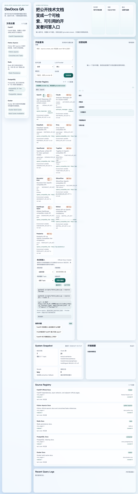
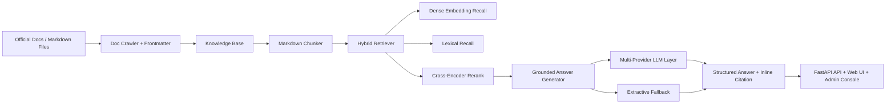
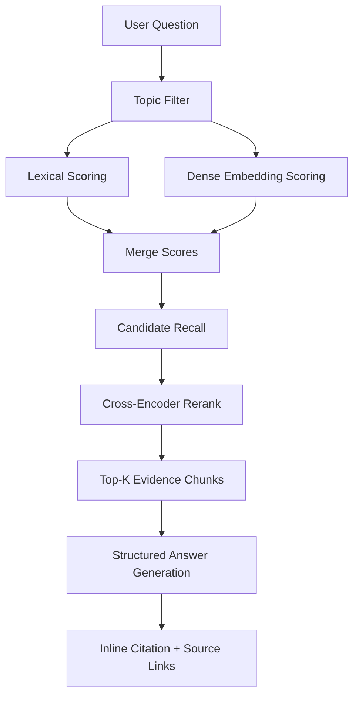

# DevDocs QA

一个面向开发者的技术文档智能问答系统，基于公开技术文档构建知识库，支持混合检索、证据引用和 API 问答服务。



当前仓库提供的是一个可运行的 RAG MVP，同时保留了继续扩展到正式产品的结构：

- 文档 ingestion
- 官方文档 crawler
- 增量抓取 + 内容 hash 去重
- 标题感知 chunking
- Hybrid retrieval
- 真实 dense embedding
- cross-encoder rerank
- multi-provider LLM answer generation
- grounded fallback generation
- 结构化输出 + 内联 citation
- provider health diagnostics
- 评测集 + 自动评测脚本
- 管理端 operator console
- 引用与原始文档链接返回
- FastAPI API
- Web 演示页面

## 0.1 快速展示

如果你要把这个项目发给面试官、同学或团队成员，建议直接展示这三个点：

- 一个开发者技术文档问答入口，而不是通用聊天机器人
- 答案带内联 citation，可跳转到证据片段和原始文档
- 支持官方文档抓取、局部重建、评测和多 LLM provider 管理

在线演示地址：

- 首页：`https://rag-production-e5f7.up.railway.app/`
- API 文档：`https://rag-production-e5f7.up.railway.app/docs`
- 健康检查：`https://rag-production-e5f7.up.railway.app/health`

## 0.2 架构图



## 0.3 检索流程图



## 0. 简历写法建议

如果你要把这个项目写进简历，建议重点写成“面向开发者场景的可落地智能问答产品”，而不是“做了一个 RAG Demo”。

更推荐的表达方向：

- 基于公开技术文档构建 developer-facing RAG QA system，支持混合检索、结构化答案和证据引用
- 设计多 provider LLM generation layer，兼容 OpenAI、Claude、DeepSeek、Groq、OpenRouter、Together、Qwen、Mistral、Perplexity 等主流模型接入
- 实现官方文档抓取、增量同步、局部索引重建、自动评测和 API/Web UI 闭环，具备真实产品化扩展基础

## 1. 项目定位

这个项目不是泛聊天机器人，而是一个更适合真实落地的开发者文档问答系统。

目标场景：

- 团队内部技术文档问答
- 公开官方文档聚合问答
- API 门户 / 开发者中心问答助手
- IDE 插件或内部工具的文档检索服务

核心价值：

- 把分散的文档内容收敛成统一问答入口
- 回答必须基于命中文档片段，不依赖自由发挥
- 返回引用片段和原始来源链接，方便继续深挖
- 通过 API 对外服务，便于二次集成

## 1.1 演示问答示例

输入问题：

```text
asyncio.create_task 和直接 await 有什么区别？
```

系统输出风格：

- 先给出结论
- 再列关键点和 caveats
- 每个关键结论附带 `[chunk-id]`
- 点击 citation 可直接高亮证据卡
- 每条证据可跳转回官方原始文档

## 2. 当前知识库主题

示例知识库基于公开技术文档主题整理：

- `FastAPI`
- `Python asyncio`
- `Redis`
- `PostgreSQL`
- `Docker`

每份知识文件都带有元数据，例如：

- `topic`
- `source_name`
- `source_url`

这样可以在问答结果中返回来源说明和跳转链接。

## 3. 系统能力

### 3.1 文档处理与采集

- 支持 Markdown / txt 文档导入
- 支持从官方文档站点抓取页面并转 Markdown
- 支持 frontmatter 元数据解析
- 支持标题感知分块
- 支持 chunk overlap

官方文档采集能力：

- 抓取器实现位于 `app/core/doc_crawler.py`
- 源站注册表位于 `data/doc_sources.json`
- CLI 位于 `scripts/fetch_docs.py`
- 抓取结果会自动写入 `data/knowledge_base/<topic>/`
- 每篇抓取结果自动附带 `topic`、`source_name`、`source_url` frontmatter
- 抓取器会维护 `data/knowledge_base/.crawl_manifest.json`
- 已抓取内容会基于 content hash 自动跳过未变化页面

### 3.2 检索能力

当前检索链路分成三层：

1. 关键词匹配
2. dense embedding 相似度召回
3. cross-encoder rerank 重排

实现策略：

- lexical score：基于词项重叠与余弦相似度
- semantic score：优先使用真实 embedding，相依赖缺失时自动退回轻量语义特征
- rerank score：使用 cross-encoder 对候选 chunk 重新排序

默认模型：

- Embedding：`sentence-transformers/paraphrase-multilingual-MiniLM-L12-v2`
- Reranker：`BAAI/bge-reranker-base`

这套配置适合当前“中文提问 + 技术文档知识库”的演示场景。

### 3.3 问答输出

当前生成链路分成两层：

1. 优先调用配置好的 LLM provider 生成结构化答案
2. 如果没有配置对应 provider 的 API Key 或调用失败，则自动回退到本地 extractive grounded answer

当前内置 provider：

- `OpenAI`：Responses API
- `Claude`：Anthropic Messages API
- `DeepSeek`：OpenAI-compatible API
- `Groq`：OpenAI-compatible API
- `OpenRouter`：OpenAI-compatible API
- `Together`：OpenAI-compatible API
- `Moonshot Kimi`：OpenAI-compatible API
- `SiliconFlow`：OpenAI-compatible API
- `DashScope Qwen`：compatible-mode API
- `Mistral`：chat completions API
- `Perplexity`：chat completions API

同时支持通过 `RAG_EXTRA_LLM_PROVIDERS_JSON` 增加更多 OpenAI-compatible provider。

Provider 运维能力：

- `GET /api/v1/llm/options` 返回所有内置和扩展 provider
- `GET /api/v1/llm/health` 返回 provider key 是否已配置、默认 provider、状态说明、最近尝试次数
- Web UI 会直接展示 configured / missing key 状态，便于演示和本地联调

稳定性增强：

- provider 超时、连接异常、429 和 5xx 会自动重试
- 默认 provider 失败时，可自动降级到其他已配置 provider
- 结构化 JSON 输出解析失败时，会走本地 repair 逻辑，尽量保住 citation 和摘要

### 3.4 评测与运维

- 内置评测集：`data/evaluation/devdocs_eval_set.json`
- 自动评测脚本：`scripts/evaluate_rag.py`
- 支持 `GET /api/v1/admin/logs` 查看最近查询日志
- 支持 `GET /api/v1/docs/sources` 查看 source registry 与抓取状态
- 支持 `POST /api/v1/docs/crawl` 触发增量抓取并按 topic 局部重建
- Web UI 已内置 operator console，可直接运行 crawl / rebuild / evaluation

默认 LLM 配置：

- Provider：`openai`
- Model：`gpt-5.4-mini`

生成约束：

- 只允许使用命中的文档证据回答
- 不允许编造 API、参数或默认行为
- 生成层先输出结构化答案对象
- 关键结论和要点必须附带内联 `chunk_id` citation

问答结果包含：

- `answer`
- `summary`
- `key_points`
- `caveats`
- `used_chunk_ids`
- `confidence_label`
- `documentation_hint`
- `related_questions`
- `answer_backend`
- `citations`
- `retrieved_chunks`

这样前端不仅能展示答案，还能展示：

- 为什么命中这段内容
- 对应来源是什么
- 用户下一步还可以问什么
- 点击 citation 后可以直接跳转并高亮对应证据卡

## 4. 技术架构

### 4.1 后端

- Python 3.11+ recommended
- FastAPI
- Pydantic v2

### 4.2 检索与模型

- `sentence-transformers`
- `torch`
- `openai`
- `anthropic`
- Hybrid RAG 自定义检索器

### 4.3 前端

- 原生 HTML / CSS / JavaScript
- 单页演示 UI

### 4.4 部署

- `Dockerfile`
- `Dockerfile.full`
- `docker-compose.yml`
- `docker-compose.full.yml`
- `railway.json`
- 单容器部署
- 数据目录 volume 挂载

## 5. 目录结构

```text
RAG/
├── app/
│   ├── api/               # FastAPI 路由与接口 schema
│   ├── core/              # chunking / retrieval / generation / model adapters
│   ├── services/          # RAG orchestration
│   ├── static/            # Web 演示页面
│   ├── config.py          # 运行配置
│   └── main.py            # FastAPI 入口
├── data/
│   ├── doc_sources.json   # 官方文档抓取源配置
│   ├── evaluation/        # 评测集
│   └── knowledge_base/    # 示例知识库 / crawler 输出目录
├── docs/
│   ├── developer-docs-product.md
│   ├── deployment.md
│   └── rag-system-plan.md
├── scripts/
│   ├── evaluate_rag.py    # 自动评测 CLI
│   ├── fetch_docs.py      # 官方文档抓取 CLI
│   └── query_demo.py      # 命令行问答示例
├── tests/
└── requirements.txt
```

## 6. 核心模块说明

### `app/core/chunking.py`

负责 Markdown 文档切分，避免生成只有标题没有正文的无效 chunk。

### `app/core/dense_models.py`

负责接入真实 embedding 和 reranker。

主要能力：

- `SentenceTransformerEncoder`
- `CrossEncoderReranker`
- 依赖不可用时自动回退

### `app/core/retrieval.py`

负责混合检索。

流程：

1. 计算 lexical score
2. 计算 dense semantic score
3. 合并初始召回分数
4. 对候选集进行 rerank
5. 返回最终 Top-K

### `app/core/generation.py`

负责生成层编排。

当前策略：

- 有可用 provider key 时：调用真实 LLM 生成结构化答案
- 无可用 provider key 时：回退到 extractive grounded answer

这种设计的优点是：

- 本地无 Key 也能跑通
- 接入 Key 后能直接升级成真实生成式问答
- 保持答案仍然受证据约束

### `app/core/llm_generation.py`

负责多 provider LLM 接入。

主要能力：

- 读取不同 provider 的 API Key
- 调用 OpenAI / Claude / OpenAI-compatible provider
- 将 top-k 证据块拼接进 prompt
- 将 LLM 输出约束为结构化 JSON
- 输出 provider catalog / health report，供 API 与前端直接消费
- provider 失败自动重试，并可降级到其他已配置 provider
- 结构化输出损坏时尝试本地 repair
- 在失败时自动交回本地 fallback

### `app/core/doc_crawler.py`

负责官方文档抓取与 HTML 到 Markdown 的标准化转换。

主要能力：

- 读取 `data/doc_sources.json`
- 限制抓取域名与页数
- 提取正文、标题、代码块
- 输出带 frontmatter 的 Markdown 文档
- 基于 manifest 做增量更新和跳过未变化页面

### `app/services/rag_service.py`

负责全链路编排：

- 加载知识库
- 构建 chunk
- 建立索引
- 支持按 topic 局部重建
- 记录最近查询日志
- 运行内置评测集
- 接收 query
- 检索并生成答案

## 7. API 设计

### 健康检查

`GET /health`

### 获取主题

`GET /api/v1/topics`

### 获取推荐问题

`GET /api/v1/suggestions`

### 获取 LLM Provider 选项

`GET /api/v1/llm/options`

这个接口会返回：

- `provider_id`
- `provider_type`
- `default_model`
- `api_key_env`
- `base_url`
- `description`

### 获取 LLM Provider 健康状态

`GET /api/v1/llm/health`

这个接口会返回：

- `provider_id`
- `configured`
- `status`
- `message`
- `selected_by_default`

### 获取索引状态

`GET /api/v1/index/stats`

返回示例字段：

- `document_count`
- `chunk_count`
- `topic_count`
- `knowledge_base_dir`
- `retrieval_backend`
- `reranker_backend`
- `generation_backend`
- `last_rebuild_at`
- `query_log_size`

### 重建索引

`POST /api/v1/index/rebuild`

支持按 topic 局部重建：

```json
{
  "topics": ["fastapi"]
}
```

### 获取抓取源状态

`GET /api/v1/docs/sources`

### 触发增量抓取

`POST /api/v1/docs/crawl`

请求示例：

```json
{
  "source_id": "fastapi",
  "limit": 2,
  "incremental": true,
  "rebuild_after": true
}
```

### 获取最近查询日志

`GET /api/v1/admin/logs`

### 运行评测集

`POST /api/v1/evaluation/run`

### 查询问答

`POST /api/v1/query`

请求示例：

```bash
curl -X POST http://127.0.0.1:8000/api/v1/query \
  -H "Content-Type: application/json" \
  -d '{
    "question": "FastAPI 的依赖注入适合解决什么问题？",
    "topic": "fastapi",
    "llm_provider": "openrouter",
    "llm_model": "anthropic/claude-3.7-sonnet",
    "top_k": 3
  }'
```

响应结构示例：

```json
{
  "question": "FastAPI 的依赖注入适合解决什么问题？",
  "answer": "结论：FastAPI dependencies let you declare shared logic once and reuse it across path operations. [dependencies-0001]\n\n关键点：\n- FastAPI dependencies are useful for shared request-time logic. [dependencies-0001]",
  "summary": "FastAPI dependencies let you declare shared logic once and reuse it across path operations. [dependencies-0001]",
  "key_points": [
    "FastAPI dependencies are useful for shared request-time logic. [dependencies-0001]"
  ],
  "caveats": [
    "Middleware is better for request-wide wrapping behavior. [dependencies-0003]"
  ],
  "used_chunk_ids": ["dependencies-0001", "dependencies-0003"],
  "topic": "fastapi",
  "confidence_label": "high",
  "documentation_hint": "回答 FastAPI 问题时，优先区分路由层、依赖注入层和 async 运行时语义。",
  "answer_backend": "openai:gpt-5.4-mini",
  "related_questions": [
    "FastAPI 依赖注入和中间件分别适合什么场景？"
  ],
  "citations": [
    {
      "chunk_id": "dependencies-0002",
      "source_name": "FastAPI Dependencies",
      "source_url": "https://fastapi.tiangolo.com/tutorial/dependencies/",
      "score": 0.80
    }
  ]
}
```

## 8. 本地运行

### 8.1 安装依赖

```bash
python3.11 -m venv .venv
source .venv/bin/activate
pip install -r requirements.txt
```

如果你的机器还没有 `python3.11`，建议优先安装 Python 3.11 再创建虚拟环境。macOS 自带的 Python 3.9 仍可运行当前仓库，但不再是推荐开发环境。

如果你想启用真实 LLM 生成，还需要配置：

```bash
export OPENAI_API_KEY=your_openai_api_key
```

如果切换其他 provider，还需要配置对应 key，例如：

```bash
export ANTHROPIC_API_KEY=your_anthropic_api_key
export DEEPSEEK_API_KEY=your_deepseek_api_key
export GROQ_API_KEY=your_groq_api_key
export OPENROUTER_API_KEY=your_openrouter_api_key
export TOGETHER_API_KEY=your_together_api_key
export MOONSHOT_API_KEY=your_moonshot_api_key
export SILICONFLOW_API_KEY=your_siliconflow_api_key
export DASHSCOPE_API_KEY=your_dashscope_api_key
export MISTRAL_API_KEY=your_mistral_api_key
export PERPLEXITY_API_KEY=your_perplexity_api_key
```

### 8.2 抓取官方文档

抓取单个来源：

```bash
python3 scripts/fetch_docs.py --source fastapi
```

批量抓取所有已注册来源，并限制每个来源最多抓取 3 页：

```bash
python3 scripts/fetch_docs.py --source all --limit 3
```

强制重写文件而不做增量跳过：

```bash
python3 scripts/fetch_docs.py --source fastapi --no-incremental
```

抓取源配置文件位于：

- `data/doc_sources.json`

抓取完成后，如需把新增文档纳入索引，执行：

```bash
curl -X POST http://127.0.0.1:8000/api/v1/index/rebuild \
  -H "Content-Type: application/json" \
  -d '{"topics":["fastapi"]}'
```

### 8.3 启动服务

```bash
uvicorn app.main:app --reload
```

启动后访问：

- Web 页面：`http://127.0.0.1:8000/`
- OpenAPI 文档：`http://127.0.0.1:8000/docs`

### 8.3.1 Docker 运行

轻量模式：

```bash
docker compose up --build
```

默认 Docker 配置会关闭 dense embeddings 和 reranker：

- `RAG_ENABLE_EMBEDDINGS=0`
- `RAG_ENABLE_RERANKER=0`

这样可以避免容器首次构建时拉取 `torch` 与 `sentence-transformers` 的大体积依赖，更适合演示、简历项目和轻量部署。

完整模型模式：

```bash
docker compose -f docker-compose.yml -f docker-compose.full.yml up --build
```

完整模式会：

- 改用 `Dockerfile.full`
- 安装完整 `requirements.txt`
- 开启 `RAG_ENABLE_EMBEDDINGS=1`
- 开启 `RAG_ENABLE_RERANKER=1`

如果你需要在容器里完整演示 dense retrieval + rerank，优先使用这个模式。

如果你只想后台运行：

```bash
docker compose up -d --build
```

停止容器：

```bash
docker compose down
```

### 8.3.2 Railway 部署

仓库已补齐 Railway 配置，可直接用 GitHub 仓库创建项目。

关键文件：

- `railway.json`
- `.env.production.example`
- `Dockerfile`

推荐首版线上环境变量：

- `RAG_ENABLE_EMBEDDINGS=0`
- `RAG_ENABLE_RERANKER=0`
- `RAG_ENABLE_LLM=1`
- `RAG_LLM_PROVIDER=openai`
- `RAG_LLM_MODEL=gpt-5.4-mini`
- 配置至少一个可用 provider key

详细步骤见：[部署说明](docs/deployment.md)

### 8.4 命令行测试

```bash
python3 scripts/query_demo.py "Redis 的 RDB 和 AOF 应该怎样取舍？" --topic redis
```

指定 provider 和模型：

```bash
python3 scripts/query_demo.py "FastAPI 的依赖注入适合解决什么问题？" \
  --topic fastapi \
  --llm-provider deepseek \
  --llm-model deepseek-chat
```

### 8.5 运行评测

```bash
python3 scripts/evaluate_rag.py
```

只评测单个 topic：

```bash
python3 scripts/evaluate_rag.py --topic fastapi --limit 4
```

### 8.6 Web 使用

1. 启动 `uvicorn app.main:app --reload`
2. 打开 `http://127.0.0.1:8000/`
3. 输入问题
4. 选择技术主题
5. 查看 provider registry 中的 configured / missing key 状态
6. 选择 LLM provider，必要时覆盖模型名
7. 提交查询
8. 点击答案里的 `[chunk-id]` 跳到并高亮对应证据卡
9. 如需扩充知识库，可直接复制 UI 中展示的 `fetch_docs.py` 命令

当前前端演示页已经支持：

- Provider 状态可视化
- 默认 provider 标记
- 结构化答案展示
- 内联 citation 点击高亮
- 原始文档跳转
- 官方文档抓取命令提示
- Source registry 状态面板
- topic 局部重建
- 评测摘要与失败样例预览
- 最近查询日志
- 一键 crawl / rebuild / evaluation 的 operator console

### 8.7 单元测试

```bash
python3 -m unittest discover -s tests
```

### 8.8 Docker 文件说明

- `Dockerfile`：轻量运行时，适合快速演示
- `Dockerfile.full`：完整运行时，适合展示 dense retrieval / rerank
- `docker-compose.yml`：默认轻量模式
- `docker-compose.full.yml`：完整模式覆盖配置
- `railway.json`：Railway 部署配置
- `.env.production.example`：生产环境变量模板

## 9. 环境变量配置

常用配置项：

- `RAG_KB_DIR`
- `RAG_DOC_SOURCES_PATH`
- `RAG_EVAL_CASES_PATH`
- `RAG_CHUNK_SIZE`
- `RAG_CHUNK_OVERLAP`
- `RAG_TOP_K`
- `RAG_MIN_SCORE`
- `RAG_LEXICAL_WEIGHT`
- `RAG_SEMANTIC_WEIGHT`
- `RAG_ENABLE_EMBEDDINGS`
- `RAG_EMBEDDING_MODEL`
- `RAG_ENABLE_RERANKER`
- `RAG_RERANKER_MODEL`
- `RAG_RERANK_CANDIDATES`
- `RAG_RERANK_WEIGHT`
- `RAG_ENABLE_LLM`
- `RAG_LLM_PROVIDER`
- `RAG_LLM_MODEL`
- `RAG_LLM_REASONING_EFFORT`
- `RAG_LLM_MAX_OUTPUT_TOKENS`
- `RAG_LLM_TIMEOUT_SECONDS`
- `RAG_LLM_MAX_RETRIES`
- `RAG_LLM_RETRY_BACKOFF_SECONDS`
- `RAG_QUERY_LOG_SIZE`
- `OPENAI_API_KEY`
- `ANTHROPIC_API_KEY`
- `DEEPSEEK_API_KEY`
- `GROQ_API_KEY`
- `OPENROUTER_API_KEY`
- `TOGETHER_API_KEY`
- `MOONSHOT_API_KEY`
- `SILICONFLOW_API_KEY`
- `DASHSCOPE_API_KEY`
- `MISTRAL_API_KEY`
- `PERPLEXITY_API_KEY`
- `RAG_EXTRA_LLM_PROVIDERS_JSON`

示例见：[.env.example](/Users/cii/RAG_PROJECT/.env.example)

如果你想继续增加新的兼容 provider，可以直接配置：

```bash
export RAG_EXTRA_LLM_PROVIDERS_JSON='[
  {
    "provider_id": "custom-gateway",
    "label": "Custom Gateway",
    "provider_type": "openai_compatible_chat",
    "api_key_env": "CUSTOM_GATEWAY_API_KEY",
    "default_model": "gpt-4o-mini",
    "base_url": "https://your-gateway.example.com/v1",
    "description": "Enterprise OpenAI-compatible gateway."
  }
]'
```

## 10. 已完成验证

当前仓库已验证：

- `python3 -m unittest discover -s tests`
- `python3 -m compileall app tests scripts`
- `scripts/fetch_docs.py` 可从 `data/doc_sources.json` 读取来源配置
- `scripts/evaluate_rag.py` 可运行内置评测集
- 轻量回退检索可运行
- 真实 `sentence-transformers` embedding 可加载
- 真实 `cross-encoder` rerank 可加载
- 未配置可用 provider key 时可自动回退到 extractive 生成
- `/api/v1/llm/health` 可返回 provider 配置状态
- `/api/v1/docs/sources`、`/api/v1/docs/crawl`、`/api/v1/evaluation/run` 可正常返回
- FastAPI 服务结构完整
- `docker compose build`
- `docker compose up -d`
- `http://127.0.0.1:8000/`
- `http://127.0.0.1:8000/docs`
- `docker compose -f docker-compose.yml -f docker-compose.full.yml config`
- Railway 部署所需 `PORT` 监听兼容已补齐

说明：

- 首次加载真实模型时会下载 Hugging Face 模型文件，耗时明显更长
- 推荐使用 Python 3.11 + OpenSSL 环境；仓库同时保留了 `urllib3<2` 约束，避免 macOS 自带 Python 3.9 + `LibreSSL` 下出现兼容性 warning
- 真实 LLM 生成层需要你提供对应 provider 的有效 API Key 才能完成联网调用
- Docker 默认使用轻量依赖集，并关闭 dense embeddings / reranker；这条路径可以直接运行 Web UI、API、crawler、重建和评测
- 仓库同时提供 `Dockerfile.full` + `docker-compose.full.yml`，用于容器内完整 dense retrieval 路径

## 11. 后续扩展建议

最值得继续做的方向：

1. 增加定时抓取、增量更新和去重策略
2. 增加更大规模的检索评测集与 answer quality benchmark
3. 支持代码片段级检索和答案中的代码高亮
4. 增加登录、团队隔离和私有知识库权限控制
5. 增加反馈闭环，把 bad case 回流到评测与 prompt 版本管理
6. 支持多知识源路由，例如官方文档、内部 ADR、SDK API Reference 联合问答

## 12. 相关文档

- [产品说明](docs/developer-docs-product.md)
- [部署说明](docs/deployment.md)
- [实施计划](docs/rag-system-plan.md)
